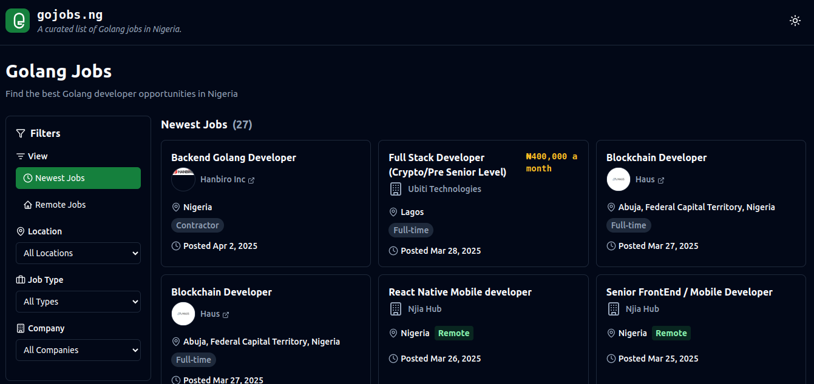
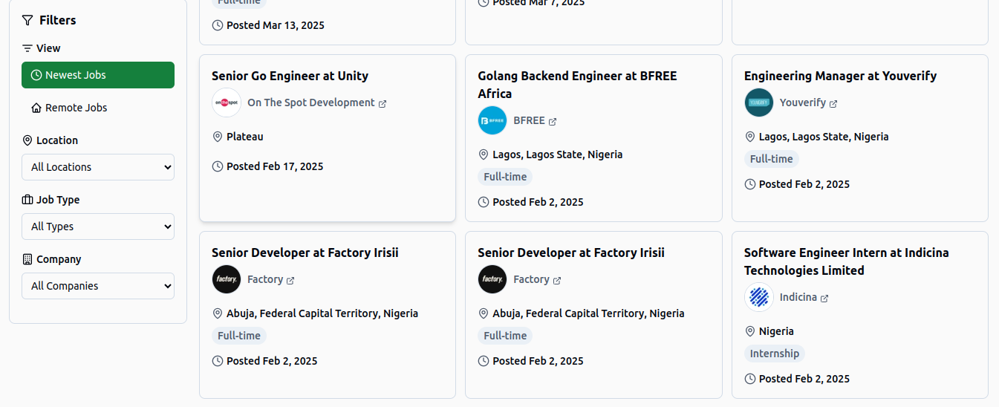

# GoJobs NG - Find Golang Jobs in Nigeria

**GoJobs NG** is a platform for Go enjoyers like myself to find job opportunities in Nigeria. It didn't make sense that you had to use international Go job boards that didnt even provide Nigerian specific jobs,unless you were searching for international jobs they would not be helpful so here we are... 


## Features
- Automatically Fetch and sync job listings from multiple sources (e.g., Google jobs, Indeed, LinkedIn).
- A http endpoint `api/jobs` to get job data.

## Web Application
Check it out here: [GoJobs NG Web](https://gojobs-ng-web.vercel.app/)





## How to Use

### 1. Clone the Repository
```bash
git clone https://github.com/yourusername/gojobs-ng.git
cd gojobs-ng/server
```

### 2. Set Up Environment Variables
Create a `.env` file in the `/` directory and configure.
See .env.example for reference

### 3. Run the Application
```bash
docker-compose up --build
```
```bash
go run cmd/server/main.go
```

### 4. Sync Jobs with Cron Jobs
To keep the job listings up-to-date, set up cron jobs to call the `/api/jobs/sync` endpoint. Example:
```bash
curl -X POST http://localhost:8080/api/jobs/sync?source=jsearch \
  -H "Content-Type: application/json" \
  -H "X-API-Key: <your_api_key>" \
  -H "ORIGIN": <origin>"
```

### 5. Available APIs
- **GET /status**: Check API status.
- **GET /api/jobs**: Fetch all jobs.
- **POST /api/jobs/sync**: Sync jobs from external sources. Requires `source` query parameter (e.g., `jsearch`, `indeed`, `linkedin`).


## Contributing
Feel free to contribute to this project by submitting issues or pull requests. 

